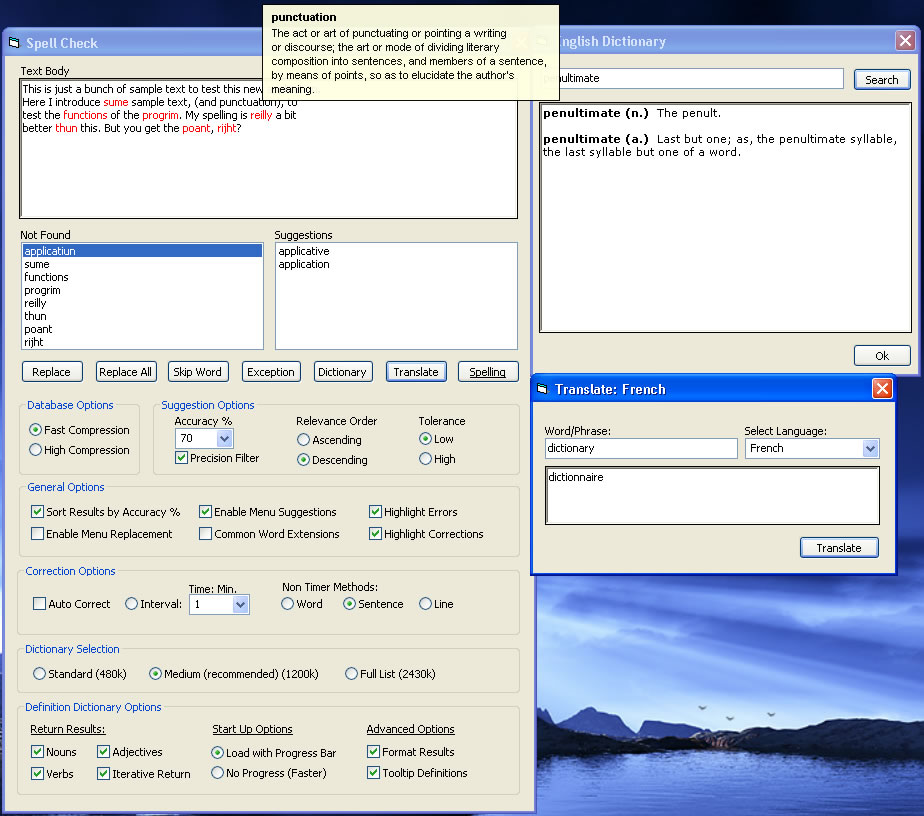



## FINAL UPDATE\!\!\! The Last Word in Spell Checkers AND NOW \.\.The Penultimate Dictionary

### Description

I searched online, and downloaded every spell checker I could find.. Most of them hooked into M$ Office libraries, and were not suitable for a finished product, the others were just too slow or inaccurate to be usefull.. So, I took the best ideas from the projects I did see, and made this.. The Ultimate Spell Checker!! Check it out.. Context menu suggestion and replacement options, suggestions returned with configurable tolerance filters, and sorted ascending/descending by relevance, (matches profiled with api driven routine), - api compression, three different dictionaries, and even with the largest, (270,000 entries!), search returns, and suggestion queries are near instantaneous! Multiple concurrent wildcard matching, punctuation filters, highlight mistakes and corrections.. etc

Addendum: Added a auto correct feature, still needs some work, particularly the api timer, I will update again in a day or so..

Tell me what you think.. If you like it Vote!

Added an update: Oct 17th. Now has automated checking with three modes, timed, by word/sentence/new line.

Update Oct 18: Added an OS check and a Huffman compression class as an alternative compression scheme for 9x/Me users, and a manifest for xp users.. Working on a translation and reference dictionary now.

Oct. 19: Added some filters, word auto highlights now when right clicked. Definition dictionary should be done in a day or so.

Update!!! Added the 'Penultimate Dictionary' 221 thousand word definitions, lightning fast lookups, word filters, tooltip definitions, and many updates.. Check it out.

----

Final Update!!! The last update is here! Now with three sample translation dictionaries, English to French/Spanish/Italian. Added more comments and some fixes/optimizations, and instructions/sample code to add any dictionary/thesaurus to the program. Enjoy..

Thanks to everyone who voted..
 
### More Info
 

             |
---                |---
**Submitted On**   |2005-10-31 14:36:22
**By**             |[Steppenwolfe](https://github.com/Planet-Source-Code/PSCIndex/blob/master/ByAuthor/steppenwolfe.md)
**Level**          |Intermediate
**User Rating**    |5.0 (278 globes from 56 users)
**Compatibility**  |VB 5\.0, VB 6\.0
**Category**       |[Complete Applications](https://github.com/Planet-Source-Code/PSCIndex/blob/master/ByCategory/complete-applications__1-27.md)
**World**          |[Visual Basic](https://github.com/Planet-Source-Code/PSCIndex/blob/master/ByWorld/visual-basic.md)
**Archive File**   |[FINAL\_UPDA19447310312005\.zip](https://github.com/Planet-Source-Code/steppenwolfe-final-update-the-last-word-in-spell-checkers-and-now-the-penultimate-dictiona__1-62915/archive/master.zip)

### API Declarations

Too many too list..

